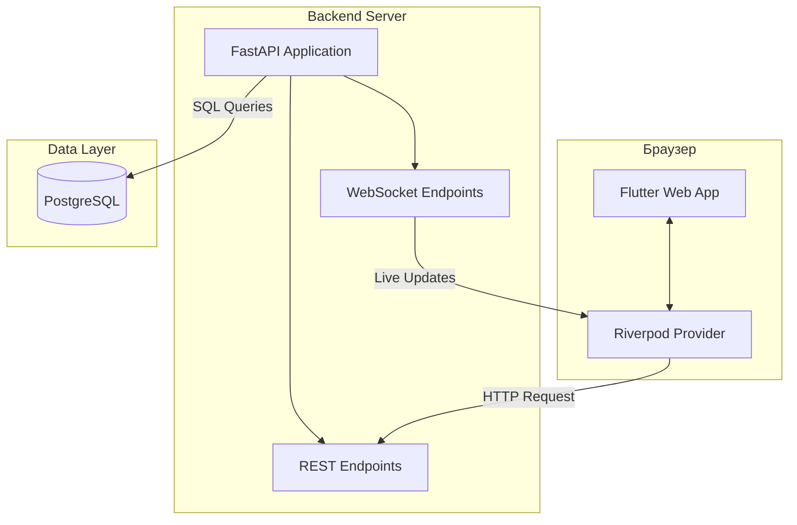
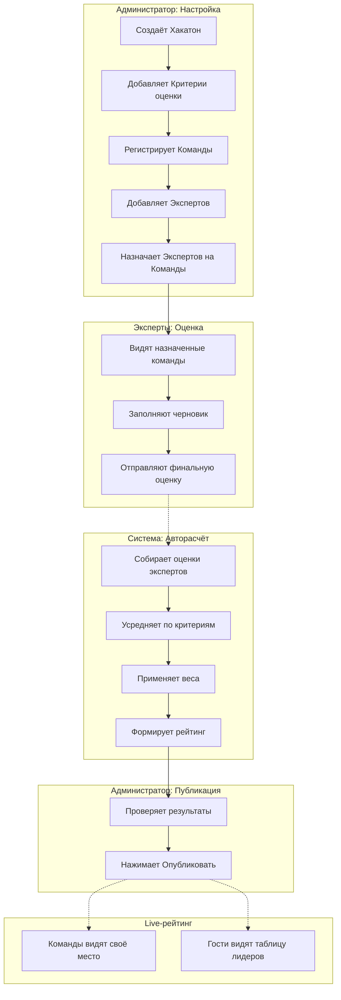

# The_Last_Siberia_TulaHack-2026

HackRank — это веб-приложение для проведения и автоматизации оценки хакатонов.  
Система заменяет ручной подсчёт в Excel, исключает ошибки, ускоряет работу жюри и делает результаты прозрачными в реальном времени.

## Главные возможности MVP

- Ролевая модель (администратор, эксперт, команда, гость)
- Конструктор критериев с весами и автопроверкой суммы 100%
- Назначение экспертов на команды
- Выставление оценок с черновиками и комментариями
- Автоматический расчёт нормализованных взвешенных баллов
- Живой рейтинг с WebSocket-обновлениями
- Публичная страница с таймером и leaderboard
- JWT-аутентификация + RBAC
- Экспорт результатов в CSV/XLSX
- Журнал действий (аудит)

## Технологический стек

| Компонент                       | Технология          |
| ------------------------------- | ------------------- |
| Frontend                        | Flutter Web         |
| Backend                         | Python + FastAPI    |
| База данных                     | PostgreSQL          |
| Real-time                       | WebSocket (FastAPI) |
| Управление состоянием (Flutter) | Riverpod / BLoC     |

Схема архитектуры взаимодействия



## Бизнес-сценарий



## Запуск

## Настройка .env (в корне)

Файл `.env` содержит конфигурацию окружения.

Обязательные параметры:

| Параметр          | Описание        | Пример          |
| ----------------- | --------------- | --------------- |
| POSTGRES_USER     | Пользователь БД | hackathon_admin |
| POSTGRES_PASSWORD | Пароль БД       | SecurePass123!  |
| POSTGRES_DB       | Имя БД          | hackathon_db    |
| BACKEND_PORT      | Порт API        | 8000            |
| DEBUG             | Режим отладки   | true/false      |

Остальные параметры имеют значения по умолчанию.

### Запуск

чистка

```
# чистка
sudo docker-compose down
sudo docker-compose down -v

# Очистить кэш Docker
sudo docker system prune -a -f
sudo docker builder prune -a -f

# Удалить все тома (ВНИМАНИЕ! Удалит данные всех проектов)
sudo docker volume prune -f
```

старт

```
# старт
sudo docker-compose up -d

# создание данных на бд
sudo docker-compose exec postgres psql -U hackathon_admin -d hackathon_db -f /docker-entrypoint-initdb.d/01-init.sql
sudo docker-compose exec postgres psql -U hackathon_admin -d hackathon_db -f /docker-entrypoint-initdb.d/02-seed.sql
sudo docker-compose exec postgres psql -U hackathon_admin -d hackathon_db -f /docker-entrypoint-initdb.d/03-indexes.sql
sudo docker-compose exec postgres psql -U hackathon_admin -d hackathon_db -f /docker-entrypoint-initdb.d/04-fix-status-migration.sql
sudo docker-compose exec postgres psql -U hackathon_admin -d hackathon_db -f /docker-entrypoint-initdb.d/05-fix-db.sql
```

логи

```
# лог flutter
sudo docker-compose logs -f backend

# лог flutter
sudo docker-compose logs -f flutter

# лог pgadmin
sudo docker-compose logs -f pgadmin

# лог postgres
sudo docker-compose logs -f postgres
```

### Доступ

## ВАЖНО! Ручное исправление базы данных

Данная глава обязательна, т.к. не все данные были отображены с помощью скриптов

Смотреть в [главу по исправлению проблем](./Fix-bd.md)

## Документация

В разделе [Документация](/docs/) представлена следующая информация:

| Тип документа            | Файл                                                                                   |
| :----------------------- | :------------------------------------------------------------------------------------- |
| Инструкции по установке  | [Методичка по установке flutter.docx](/docs/Методичка%20по%20установке%20flutter.docx) |
| Работа с инфраструктурой | [Методичка по работе с docker.docx](/docs/Методичка%20по%20работе%20с%20docker.docx)   |
| Архитектура postgresql   | [Методичка по работе с docker.docx](/docs/Архитектура_postresql.md)                    |
