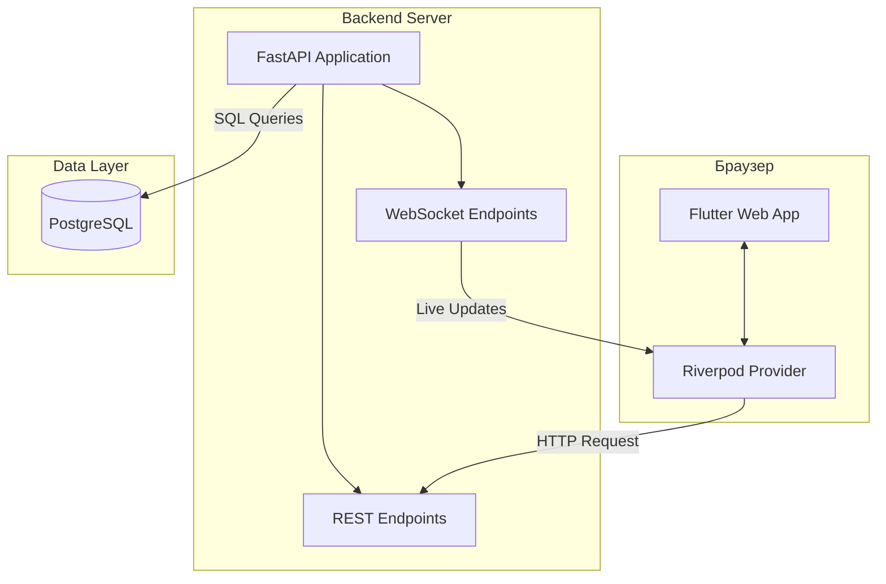
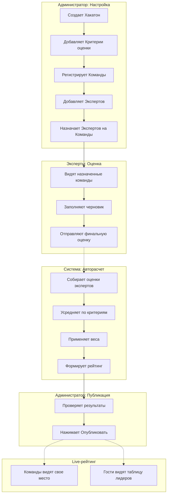

# The_Last_Siberia_TulaHack-2026

HackRank — это веб-приложение для проведения и автоматизации оценки хакатонов.  
Система заменяет ручной подсчет в Excel, исключает ошибки, ускоряет работу жюри и делает результаты прозрачными в реальном времени.

## Содержание

- [Главные возможности MVP](#главные-возможности-mvp)
- [Технологический стек](#технологический-стек)
- [Бизнес-сценарий](#бизнес-сценарий)
- [Запуск проекта](#запуск-проекта)
  - [Структура проекта](#структура-проекта)
  - [Настройка .env](#настройка-env-в-корне)
  - [Запуск через Docker Compose](#запуск-через-docker-compose)
  - [Запуск через Docker Compose (новый плагин)](#запуск-через-docker-compose-новый-плагин)
  - [Инициализация базы данных](#инициализация-базы-данных)
  - [Просмотр логов](#просмотр-логов)
  - [Доступ к системе](#доступ-к-системе)
- [ВАЖНО! Ручное исправление базы данных](#важно-ручное-исправление-базы-данных)
- [Документация](#документация)

## Главные возможности MVP

- Ролевая модель (администратор, эксперт, команда, гость)
- Конструктор критериев с весами и автопроверкой суммы 100%
- Назначение экспертов на команды
- Выставление оценок с черновиками и комментариями
- Автоматический расчет нормализованных взвешенных баллов
- Живой рейтинг с WebSocket-обновлениями
- Публичная страница с таймером и leaderboard
- JWT-аутентификация + RBAC
- Экспорт результатов в CSV/XLSX
- Журнал действий (аудит)

## Технологический стек

| Компонент                       | Технология          |
| ------------------------------- | ------------------- |
| Frontend                        | Flutter Web         |
| Backend                         | Python + FastAPI    |
| База данных                     | PostgreSQL          |
| Real-time                       | WebSocket (FastAPI) |
| Управление состоянием (Flutter) | Riverpod / BLoC     |

Схема архитектуры взаимодействия



## Бизнес-сценарий



## Запуск проекта

### Настройка .env (в корне)

Файл `.env` содержит конфигурацию окружения.

Обязательные параметры:

| Параметр          | Описание        | Пример          |
| ----------------- | --------------- | --------------- |
| POSTGRES_USER     | Пользователь БД | hackathon_admin |
| POSTGRES_PASSWORD | Пароль БД       | SecurePass123!  |
| POSTGRES_DB       | Имя БД          | hackathon_db    |
| BACKEND_PORT      | Порт API        | 8000            |
| DEBUG             | Режим отладки   | true/false      |

Остальные параметры имеют значения по умолчанию.

### Запуск через Docker Compose

Это стандартный способ запуска для большинства сред. Используется команда с дефисом `docker-compose`.

Очистка окружения:

```bash
# Остановка контейнеров и удаление томов проекта
sudo docker-compose down -v

# Очистить кэш сборки Docker
sudo docker system prune -a -f
sudo docker builder prune -a -f

# Удалить все неиспользуемые тома (ВНИМАНИЕ! Удалит данные всех проектов, не только текущего)
sudo docker volume prune -f
```

Старт сервисов:

```bash
# Запуск в фоновом режиме
sudo docker-compose up -d
```

### Запуск через Docker Compose (новый плагин)

> [!NOTE]
> Данный раздел предназначен для MVP и тестовых сред, где используется встроенный плагин Docker (`docker compose` без дефиса), либо если команда `docker-compose` не найдена.

Если у вас установлен Docker Engine с плагином Compose V2, заменяйте команды `docker-compose` на `docker compose`.

Очистка окружения (плагин):

```bash
# Остановка контейнеров и удаление томов проекта
sudo docker compose down -v

# Очистка кэша сборки
sudo docker system prune -a -f
sudo docker builder prune -a -f

# Удаление неиспользуемых томов
sudo docker volume prune -f
```

Старт сервисов (плагин):

```bash
# Запуск в фоновом режиме
sudo docker compose up -d
```

### Инициализация базы данных

После того как контейнер `postgres` запустится и станет доступен (обычно через 10-15 секунд после `up -d`), выполните скрипты миграции по порядку:

```bash
docker compose exec postgres pg_isready -U hackathon_admin -d hackathon_db

# 01-init.sql - базовая структура
docker compose exec postgres psql -U hackathon_admin -d hackathon_db -f /docker-entrypoint-initdb.d/01-init.sql

# 02-seed.sql - начальные данные
docker compose exec postgres psql -U hackathon_admin -d hackathon_db -f /docker-entrypoint-initdb.d/02-seed.sql

# 03-indexes.sql - индексы
docker compose exec postgres psql -U hackathon_admin -d hackathon_db -f /docker-entrypoint-initdb.d/03-indexes.sql

# 04-fix-status-migration.sql - исправление enum (важно!)
docker compose exec postgres psql -U hackathon_admin -d hackathon_db -f /docker-entrypoint-initdb.d/04-fix-status-migration.sql

# 05-fix-db.sql - дополнительные исправления
docker compose exec postgres psql -U hackathon_admin -d hackathon_db -f /docker-entrypoint-initdb.d/05-fix-db.sql
```

> Если вы используете новый плагин, замените `docker-compose` на `docker compose`.

### Просмотр логов

Для отладки можно смотреть логи конкретных сервисов:

```bash
# Лог бэкенда (FastAPI)
sudo docker-compose logs -f backend

# Лог фронтенда (Flutter Web)
sudo docker-compose logs -f flutter

# Лог интерфейса управления БД
sudo docker-compose logs -f pgadmin

# Лог базы данных
sudo docker-compose logs -f postgres
```

### Доступ к системе

Само решение представлено по адресу: `http://94.141.160.86:8080` (при локальном запуске используйте `http://localhost:8080`).

Тестовые учетные записи:

| Роль               | Логин               | Пароль       | Назначение                                                            |
| ------------------ | ------------------- | ------------ | --------------------------------------------------------------------- |
| Администратор      | `admin`             | `Admin123!`  | Управление хакатоном, пользователями, критериями, просмотр лидерборда |
| Эксперт №1         | `expert1`           | `Expert123!` | Оценка команд, просмотр назначенных команд                            |
| Команда (участник) | `team_code_wizards` | `Team123!`   | Доступ в командный кабинет, просмотр своих данных                     |

## ВАЖНО! Ручное исправление базы данных

Данная глава обязательна, т.к. не все данные были отображены с помощью скриптов.

Смотрите подробности в файле: [Fix-bd.md](./Fix-bd.md)

## Документация

### Основные документы

В разделе [docs](/docs/) представлена следующая информация:

| Тип документа            | Файл                                                                                   |
| :----------------------- | :------------------------------------------------------------------------------------- |
| Инструкции по установке  | [Методичка по установке flutter.docx](/docs/Методичка%20по%20установке%20flutter.docx) |
| Работа с инфраструктурой | [Методичка по работе с docker.docx](/docs/Методичка%20по%20работе%20с%20docker.docx)   |
| Архитектура postgresql   | [Архитектура_postresql.md](/docs/Архитектура_postresql.md)                             |

### QA и Тестирование

Документация и отчеты по тестированию находятся в [директории QA_Service_Lab](./QA_Service_Lab/)

| Тип документа                             | Файл                                                                                                                                        |
| :---------------------------------------- | :------------------------------------------------------------------------------------------------------------------------------------------ |
| Документация по внедрению Git Actions     | [Докукментация по внедрению git actiion.docx](./QA_Service_Lab/Докукментация%20по%20внедрению%20git%20actiion.docx)                         |
| Документация по тестированию сервера и БД | [Докукментация по тестированию сервера и postresql.docx](./QA_Service_Lab/Докукментация%20по%20тестированию%20сервера%20и%20postresql.docx) |
| Документация по тестированию интерфейса   | [Документация по тестированию интерфейса HackRank.docx](./QA_Service_Lab/Документация%20по%20тестированию%20интерфейса%20HackRank.docx)     |
| Отчет по тестированию                     | [Отчет по тестированию.docx](./QA_Service_Lab/Отчет%20по%20тестированию.docx)                                                               |
| Скриншоты тестирования                    | [Директория screens](./QA_Service_Lab/screens/)                                                                                             |
| Тестовые скрипты API                      | [Директория test_api](./QA_Service_Lab/test_api/)                                                                                           |

Структура директории QA_Service_Lab:

```

```
