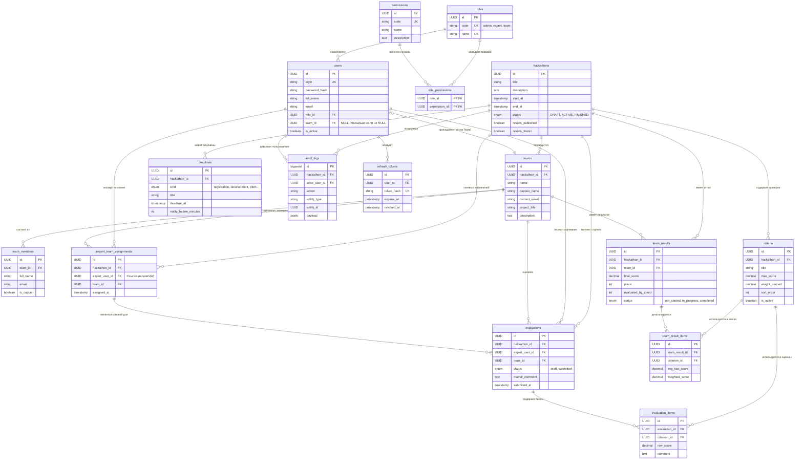

# Схема связей базы данных

# Описание таблиц

Основные сущности

- `hackathons`: Главная сущность мероприятия. Хранит название, даты проведения, текущий статус (`DRAFT`, `ACTIVE`, `FINISHED`), а также флаги публикации и заморозки результатов.
- `teams`: Команды, участвующие в конкретном хакатоне. Содержит название команды, капитана и описание проекта.
- `users`: Аккаунты пользователей системы (администраторы, эксперты, команды). Связь с командой (`team_id`) уникальна: у одного аккаунта может быть либо 0, либо 1 команда, и наоборот.

Роли и доступ (RBAC)

- `roles`: Роли (`admin`, `expert`, `team`).
- `permissions`: Список конкретных прав (например, `users.create`, `evaluations.submit`).
- `role_permissions`: Связка Многие-ко-Многим между ролями и правами.

Процесс оценки

- `criteria`: Критерии оценки для конкретного хакатона. Определяет название, максимальный балл и вес в процентах от итоговой оценки.
- `expert_team_assignments`: Назначения экспертов на команды. Эксперт может оценивать только те команды, к которым он привязан в этой таблице.
- `evaluations`: Заголовок оценочной формы, которую эксперт заполняет на команду. Может быть черновиком (`draft`) или отправленной (`submitted`).
- `evaluation_items`: Строки оценочной формы. Содержат конкретный `raw_score` (сырой балл) эксперта по определенному критерию.

Результаты и лидерборд

- `team_results`: Кеширующая таблица для быстрого построения турнирной таблицы. Содержит итоговый балл (`final_score`), занятое место (`place`) и статус расчета.
- `team_result_items`: Детализация итогового результата по каждому критерию (средний балл от всех экспертов, взвешенный балл).

Вспомогательные и системные таблицы

- `team_members`: Участники команды (не обязательно пользователи системы, просто ФИО). Флаг `is_captain` определяет капитана.
- `deadlines`: Ключевые даты хакатона (конец регистрации, сдача проектов). Используется для уведомлений.
- `audit_logs`: Журнал аудита всех важных действий в системе (кто, когда и что изменил).
- `refresh_tokens`: Хранилище Refresh токенов для механизма аутентификации (обновление Access токенов без повторного ввода пароля).
